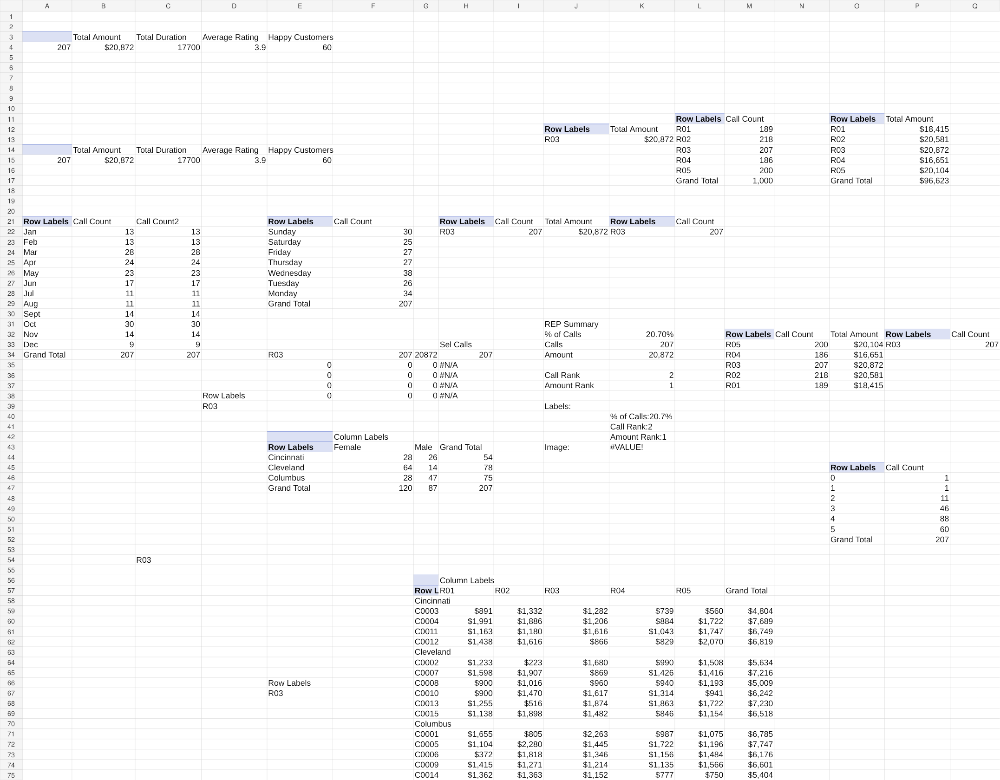
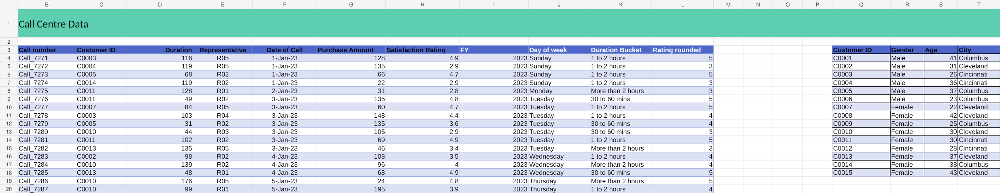

# Call Center Performance Analysis — Excel Project

## Project Overview

This project is an end-to-end **Excel call center performance analysis and dashboard** built from call-level customer service data.

The workbook combines structured data preparation, Excel formulas, PivotTables, PivotCharts, helper calculations, ranking logic, and slicer-driven analysis to turn raw call records into an interactive management dashboard.

### Business questions explored

- How many calls were handled and what was the total purchase amount?
- How does call volume change by month?
- Which days of the week have the highest/lowest call activity?
- How are calls distributed across sales representatives?
- How does purchase amount compare across representatives?
- How do customer ratings and satisfaction behave?
- How does caller gender vary by city?
- Which representative is selected and how does their activity compare with the wider group?
- How can an interactive dashboard be used to explore representative performance?

---

## Workbook Structure

### `Data`
The main working dataset containing **1,000 call records** plus customer attributes and derived fields.

Key fields include:

- Call number
- Customer ID
- Duration
- Representative
- Date of Call
- Purchase Amount
- Satisfaction Rating
- FY
- Day of week
- Duration Bucket
- Rating rounded
- Customer ID
- Gender
- Age
- City

### `Pivot Tables`
A dedicated analysis layer containing **16 PivotTables** and supporting/helper calculations.

Analyses include:

- Business summary KPIs
- Monthly call trend
- Weekly / weekday call trend
- Representative call performance
- Representative amount performance
- Representative summaries
- Satisfaction / rating distribution
- City × gender analysis
- Customer × representative amount matrix
- Selected-representative metrics
- Call and amount ranking logic
- Helper ranges used by dashboard visuals

### `Dashboard Customer Care Center`
The main presentation layer titled:

**The Call Center Representatives Performance**

The dashboard combines KPI cards, trend charts, comparison charts, representative-level analysis, and an interactive **Representative slicer**.

### `Assets`
Supporting representative image / lookup area used by the dashboard design.

---

## Dashboard Visuals

The dashboard contains **6 charts**:

1. **Calls Trend By Months** — monthly call-volume trend.
2. **Call Trends By Week-Days** — comparison of calls across weekdays.
3. **Male Vs Female Callers** — city-level comparison of male and female callers.
4. **Ratings** — distribution of rounded customer satisfaction ratings.
5. **Calls** — representative-level call comparison.
6. **Amount** — representative-level purchase amount comparison.

The dashboard also includes KPI cards for:

- Total Calls
- Total Amount
- Total Duration
- Average Rating
- Happy Customers

---

## Excel Techniques Used

### 1. Calculated / derived columns

The project creates additional analytical fields from the raw data, including:

**Financial Year**

```excel
=IF(MONTH([@[Date of Call]])<=6,YEAR([@[Date of Call]]),YEAR([@[Date of Call]])+1)
```

**Day of week**

```excel
=TEXT([@[Date of Call]],"DDDD")
```

**Duration Bucket**

```excel
=IFS(
[@[Duration]]<=10,"Under 10 mins",
[@[Duration]]<=30,"10 to 30 mins",
[@[Duration]]<=60,"30 to 60 mins",
[@[Duration]]<=120,"1 to 2 hours",
TRUE,"More than 2 hours"
)
```

**Rounded rating**

```excel
=ROUND([@[Satisfaction Rating]],0)
```

### 2. PivotTable analysis

PivotTables are used to aggregate call counts, purchase amounts, durations, ratings, representatives, weekdays, months, cities and gender.

### 3. PivotCharts

The project turns PivotTable outputs into management-friendly visuals rather than relying only on raw tables.

### 4. Slicers

An interactive **Representative** slicer is used to filter connected PivotTable analyses and dashboard views.

### 5. Lookup logic

The project uses `XLOOKUP` for selected-representative lookups, for example:

```excel
=XLOOKUP(C54,H22:H26,I22:I26)
```

and:

```excel
=XLOOKUP(C54,H22:H26,J22:J26)
```

### 6. Ranking

Representative performance is ranked using `RANK.AVG`, for example:

```excel
=RANK.AVG(K33,N33:N37)
```

and:

```excel
=RANK.AVG(K34,O33:O37)
```

### 7. Helper tables / chart support

Linked helper ranges are used to feed dashboard charts and to separate the calculation layer from the visual presentation layer.

### 8. Dynamic array / modern Excel work

The project also applies modern Excel functions and spill-style calculations during the broader project workflow, including:

- `SORT`
- `TAKE`
- `UNIQUE`
- `FILTER`
- `TRANSPOSE`
- `XLOOKUP`
- `CHOOSECOLS`
- `COUNTIFS`
- `MEDIAN`

These techniques were used for Top/Bottom analysis, filtered results, unique lists, lookups and representative-level summaries.

---

## Data & Analysis Workflow

```text
Raw Call Data
     ↓
Structured Excel Table
     ↓
Derived Columns
(FY / Weekday / Duration Bucket / Rounded Rating)
     ↓
PivotTables
     ↓
Helper Calculations
(XLOOKUP / Ranking / Selection Logic)
     ↓
PivotCharts + KPI Cards
     ↓
Interactive Representative Slicer
     ↓
Call Center Performance Dashboard
```

---

## Skills Demonstrated

This project demonstrates practical experience with:

- Microsoft Excel
- Excel Tables
- Data preparation
- Formula-driven analysis
- Dynamic array functions
- Conditional logic
- Lookups
- Ranking
- Aggregation
- PivotTables
- PivotCharts
- Slicers
- KPI design
- Dashboard development
- Data visualization
- Business-oriented performance analysis

---

## Portfolio Highlights

This project is designed to demonstrate more than basic spreadsheet work. It shows the ability to:

- Transform raw operational data into analysis-ready fields.
- Build reusable PivotTable-based analytical views.
- Create interactive dashboard reporting.
- Combine formulas with PivotTable outputs.
- Use lookup and ranking logic for selected-entity analysis.
- Present call center performance in a management-friendly format.

---

## Preview

### Dashboard


### PivotTables



### Data



---

## Files

- `Call_Center_Performance_Analysis.xlsx` — complete Excel project workbook.
- `PROJECT_DETAILS.md` — detailed project description and analytical components.
- `FORMULAS_AND_METHODS.md` — key formulas and Excel techniques used.
- `screenshots/` — visual previews for the GitHub README.

---

## Author

**Shivinder Pal Singh**

Master's in Data Analytics | Excel | SQL | Power BI | Data Analysis
